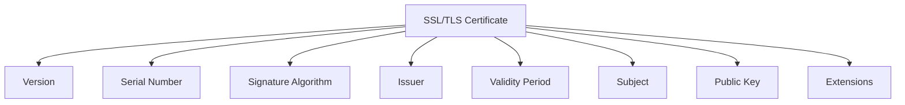
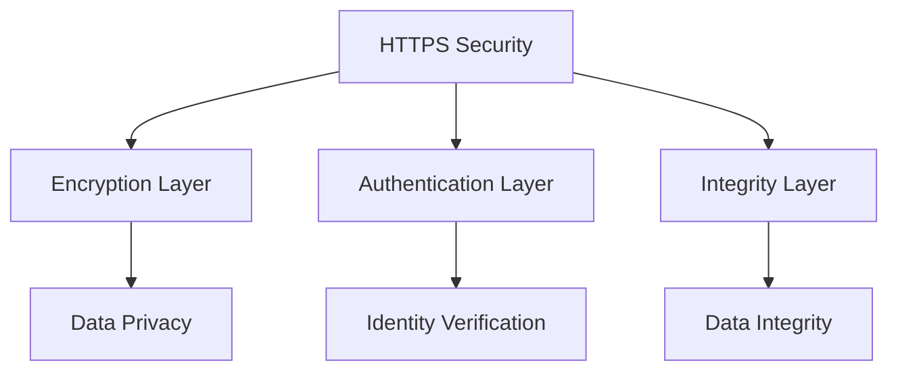
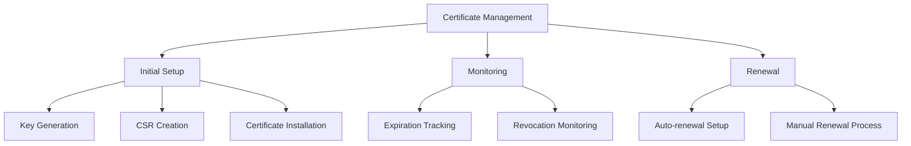
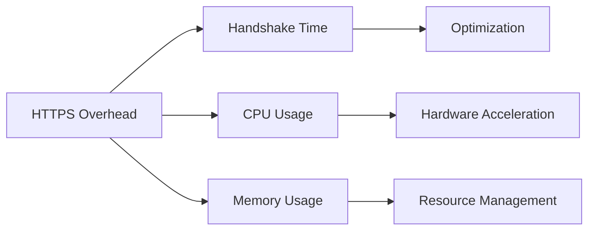

import { ArticleLayout } from '@/components/ui'
import Image from 'next/image'

export const article = {
  author: 'Khanh Pham',
  date: '2025-03-24',
  title:
    'Understanding HTTPS: A Comprehensive Guide to Secure Web Communication',
  description:
    'Learn how HTTPS works, its importance in web security, and the underlying mechanisms that protect your online communications.',
}

export const metadata = {
  title: article.title,
  description: article.description,
}

export default (props) => <ArticleLayout article={article} {...props} />

HTTPS (Hypertext Transfer Protocol Secure) is the secure version of HTTP, the protocol used for transmitting data between a web browser and a website. In this comprehensive guide, we'll explore how HTTPS works, why it's important, and the mechanisms that make it secure.

## What is HTTPS?

HTTPS is a protocol that ensures secure communication over a computer network, particularly the internet. It's widely used to protect sensitive data transmission, such as credit card information, login credentials, and personal data.


### Key Features of HTTPS

1. **Encryption**: All data is encrypted using SSL/TLS protocols
2. **Authentication**: Verifies the identity of the website
3. **Data Integrity**: Ensures data hasn't been tampered with during transmission
4. **Privacy**: Protects sensitive information from eavesdroppers

## How HTTPS Works

### 1. SSL/TLS Handshake Process

The HTTPS connection process begins with an SSL/TLS handshake, which establishes a secure connection between the client and server. Here's how it works:


1. **Client Hello**

   - Browser sends supported SSL/TLS versions
   - Sends supported cipher suites
   - Generates a random number

2. **Server Hello**

   - Server selects SSL/TLS version
   - Chooses cipher suite
   - Sends its certificate
   - Generates a random number

3. **Certificate Verification**

   - Browser verifies server's certificate
   - Checks certificate chain
   - Validates against trusted CAs

4. **Key Exchange**
   - Server and client exchange public keys
   - Generate session keys
   - Establish secure channel

### 2. Asymmetric and Symmetric Encryption

HTTPS uses both asymmetric and symmetric encryption to provide secure communication. Let's break down how these two types of encryption work together:

#### Comparison of Encryption Types

| Feature           | Asymmetric Encryption                    | Symmetric Encryption         |
| ----------------- | ---------------------------------------- | ---------------------------- |
| Key Usage         | Different keys for encryption/decryption | Same key for both operations |
| Speed             | Slower (1000x slower than symmetric)     | Fast and efficient           |
| Key Distribution  | Complex (requires secure channel)        | Simple (exchanged securely)  |
| Use Case          | Initial handshake, key exchange          | Data transmission            |
| Common Algorithms | RSA, DSA, ECC                            | AES, DES, 3DES               |
| Key Length        | 2048-4096 bits                           | 128-256 bits                 |

#### How They Work Together

1. **Initial Connection (Asymmetric)**

   ```mermaid
   sequenceDiagram
      Client->>Server: Send public key request
      Server->>Client: Send server's public key
      Client->>Server: Encrypt session key with server's public key
      Server->>Client: Decrypt session key with private key
   ```

2. **Data Transmission (Symmetric)**
   ```mermaid
   sequenceDiagram
      Client->>Server: Encrypt data with session key
      Server->>Client: Decrypt data with session key
      Server->>Client: Encrypt response with session key
      Client->>Server: Decrypt response with session key
   ```

## SSL/TLS Certificate

SSL/TLS certificates are digital documents that establish trust and enable secure communication. Let's explore their structure and components:

### Certificate Structure



### Certificate Chain


### Certificate Components Explained

| Component                 | Purpose                     | Example                             |
| ------------------------- | --------------------------- | ----------------------------------- |
| Public Key                | Used for encryption         | RSA 2048-bit key                    |
| Private Key               | Used for decryption         | Stored securely on server           |
| Digital Signature         | Verifies authenticity       | SHA-256 with RSA                    |
| Subject Alternative Names | Multiple domain support     | \*.example.com                      |
| Key Usage                 | Defines certificate purpose | Digital Signature, Key Encipherment |

## Security Benefits

### 1. Data Protection

HTTPS provides multiple layers of protection against various security threats:

#### Threat Protection Matrix

| Threat            | Protection Method         | Impact                       |
| ----------------- | ------------------------- | ---------------------------- |
| Man-in-the-Middle | Certificate validation    | Prevents interception        |
| Eavesdropping     | Encryption                | Data remains private         |
| Data tampering    | Message authentication    | Ensures integrity            |
| Session hijacking | Secure session management | Prevents unauthorized access |

#### Security Layers



### 2. Authentication

The authentication process in HTTPS involves multiple steps:

1. **Certificate Validation**

   - Chain of trust verification
   - Certificate revocation checking
   - Domain name validation

2. **Identity Verification**
   - Organization validation
   - Extended validation (EV)
   - Domain validation (DV)

### 3. SEO Benefits

HTTPS's impact on SEO can be quantified:

| SEO Factor          | Impact | Implementation Priority |
| ------------------- | ------ | ----------------------- |
| Search Ranking      | High   | Critical                |
| User Trust          | High   | Critical                |
| Page Load Speed     | Medium | Important               |
| Mobile Optimization | Medium | Important               |
| Core Web Vitals     | Medium | Important               |

## Common HTTPS Ports

- HTTPS: Port 443
- HTTP: Port 80

## Implementation Best Practices

### Certificate Management Checklist



### Protocol Configuration Matrix

| Setting          | Recommended Value | Impact      |
| ---------------- | ----------------- | ----------- |
| TLS Version      | 1.2 or 1.3        | Security    |
| Cipher Suites    | Strong (AES-256)  | Performance |
| Certificate Type | EV or OV          | Trust       |
| Key Size         | 2048+ bits        | Security    |
| HSTS             | Enabled           | Security    |

### Performance Optimization Guide

1. **HTTP/2 Benefits**

   - Multiplexing
   - Server push
   - Header compression

2. **OCSP Stapling**

   - Reduces latency
   - Improves privacy
   - Better reliability

3. **HSTS Implementation**
   - Prevents downgrade attacks
   - Improves security
   - Better user experience

## Common HTTPS Issues

### Issue Resolution Matrix

| Issue              | Cause               | Solution             | Priority |
| ------------------ | ------------------- | -------------------- | -------- |
| Mixed Content      | HTTP resources      | Update to HTTPS      | High     |
| Certificate Expiry | Time management     | Auto-renewal         | High     |
| Performance Impact | Handshake overhead  | Optimization         | Medium   |
| Browser Warnings   | Invalid certificate | Proper configuration | High     |

### Performance Impact Analysis



## Future of HTTPS

1. **TLS 1.3**

   - Faster handshake
   - Improved security
   - Better performance

2. **Post-Quantum Cryptography**
   - Quantum-resistant algorithms
   - Future-proof security
   - Enhanced protection

## Conclusion

HTTPS is essential for secure web communication. Understanding how it works helps developers implement better security practices and maintain secure applications. As web security evolves, staying updated with the latest HTTPS developments and best practices is crucial for maintaining secure web applications.

Remember:

- Always use HTTPS for sensitive data
- Keep certificates up to date
- Follow security best practices
- Monitor for security issues
- Stay informed about new developments

## References

1. Internet Engineering Task Force. (2000). HTTP Over TLS (RFC 2818). Retrieved from https://datatracker.ietf.org/doc/html/rfc2818

2. SSL.com. (n.d.). SSL/TLS Protocol. Retrieved from https://www.ssl.com/guide/ssl-handshake/

3. OWASP Foundation. (2023). Testing for Weak SSL/TLS Ciphers, Insufficient Transport Layer Protection. Retrieved from https://owasp.org/www-project-web-security-testing-guide/latest/4-Web_Application_Security_Testing/09-Testing_for_Weak_Cryptography/01-Testing_for_Weak_SSL_TLS_Ciphers_Insufficient_Transport_Layer_Protection

4. Google. (2024). HTTPS Transparency Report. Retrieved from https://transparencyreport.google.com/https/overview

5. Let's Encrypt. (2024). Let's Encrypt Documentation. Retrieved from https://letsencrypt.org/docs/

6. Rescorla, E. (2018). The Transport Layer Security (TLS) Protocol Version 1.3 (RFC 8446). Retrieved from https://datatracker.ietf.org/doc/html/rfc8446

7. Barnes, R., & Thomson, M. (2015). Using TLS in Applications (RFC 7525). Retrieved from https://datatracker.ietf.org/doc/html/rfc7525

8. Mozilla. (2024). HTTP Strict Transport Security (HSTS). Retrieved from https://developer.mozilla.org/en-US/docs/Web/HTTP/Headers/Strict-Transport-Security

9. Cloudflare. (2024). SSL/TLS Encryption and Certificates. Retrieved from https://www.cloudflare.com/learning/ssl/

10. National Institute of Standards and Technology. (2023). Guidelines for the Selection, Configuration, and Use of Transport Layer Security (TLS) Implementations. Retrieved from https://nvlpubs.nist.gov/nistpubs/SpecialPublications/NIST.SP.800-52r2.pdf
